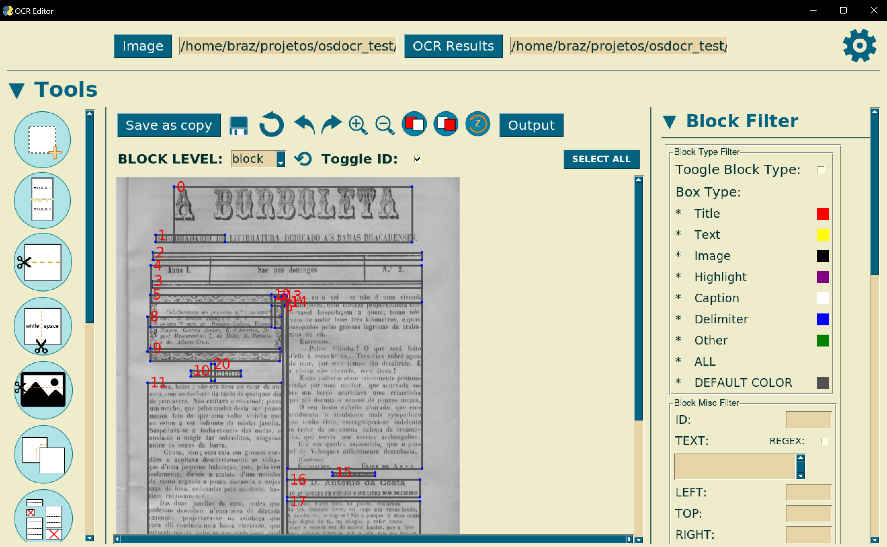

# **OSDOCR - Old Structured Documents OCR**

This repository provides the project for a thesis of the same name, with the purpose of providing a **Toolkit** for enhancing the manipulation and analysis of OCR results, thus enhancing the final output of OCR.

The study cases for this work were mostly focused on old documents, in particular newspapers for their challenging layouts.

The base of the **Toolkit** is the data structure **OCR Tree**, used to store and represent the results of OCR.

Besides the **Toolkit**, two applications of it are here available: 
* a **Pipeline** for applying OCR; 
* a **OCR Tree Editor** which allows for easy manipulation of **OCR Tree** through a graphical editor;

## **Main commands**

* **OSDOCR** : to invoke the pipeline
* **ocr_editor** : to invoke the OCR Tree graphical editor

## **Installation**

    pip install OSDOCR

## **Auxiliary repositories**

* [**document_image_utils**](https://github.com/brazafonso/document_image_processing) : repository that provides some image focused methods for the Toolkit. Also developed in the context of the thesis.
* [**waifu2x**](https://github.com/nagadomi/waifu2x) : module used for image upscaling.
* [**HVI-CIDNet**](https://github.com/Fediory/HVI-CIDNet) : module used for image light correction.

# **OCR Tree**

This structured based on data trees is based on the dictionary based output of Tesseract. It has 5 main node levels:

* page
* block
* paragraph
* line
* word

And the main attributes

* id
* type : specific for the newspaper documents and the methods created surrounding these
* text : only filled on the *word* level
* conf : text confidence

It provides conversion methods to, and from, **HOCR** so as to keep compatibility with standard formats. 

To allow the manipulation of the space dimension of the nodes in the Tree, the auxiliary class **Box* was also developed.

## **Box**

This structure represents the position and dimensions of an entity in a space, assuming that it is of a rectangular shape. It also provides tools for its ease of manipulation, such as moving, scaling, calculating distance, etc.

### **Methods**

#### **Move, Update**

Allow for updating the location of a box. **Move** is a relative update whilst **update** is absolute. **Update** provides an argument to prevent the box from being inverted.

#### **Check if boxes align**

**within_vertical_boxes** and **within_horizontal_boxes** checks if two boxes are aligned through the respective axis, given a specific margin of leeway. A flag can be passed to disable the double way check.

#### **Check if boxes intersect**

**intersects_box** checks if two boxes intersect.

Flags *extend_vertical* and *extend_horizontal* allow for an easier check along each of the axis. *inside* enables a box that is inside another to be considered an intersection.

**intersect_area_box** returns the area of intersection of two boxes. The return value is of type **Box**.

**remove_box_area** can be used to remove a given area (solve intersection) from a box while applying the changes that least affect the original area.

#### **Join boxes**

Using the **join** method, to make it so the dimensions of the original box match the location of the two boxes.

#### **Distances**

**distance_to** provides different methods to calculate the distance between two boxes. These are:

* distance between two specific borders
* closest: tries to discern what is the smallest distance between the boxes by making checks for boxes alignments

**distance_to_point** calculates the distance between the box and a point by verifying the difference between the variation of x and y, relative to box's width and height, to the point.

**closest_edge_point** returns the edge of the box that is closest to a given point. Only returns a string representing the edge.

## **Methods**

### **Convertors**

**OCR Tree**

**JSON**

**HOCR**

**CSV** : only to

**TXT** : only to

### **Id boxes**

**id_boxes** allows for easily giving ids to the whole tree or only specific levels and area. 

Flag *override* makes it so only nodes without id are updated.

*Ids* parameter allows for choosing a specific start point for id count.

### **Get boxes**

**get_box_id**

**get_boxes_level**

**get_boxes_in_area** provides a way for getting boxes that are inside a specific area.

**get_boxes_intersect_area** provides a simpler way for getting boxes that are inside a specific area, or have at least a specific ratio of intersection with it.

### **Text analysis**

**calculate_mean_height** returns the mean height of a level of boxes.

**calculate_character_mean_width** returns the mean width of characters of the text of a node.

**is_text_size** checks if a node's text is of a specified text size, within a given range.

**is_empty** checks if a node has no text

**is_vertical_text** checks if a node with text is vertical text. This is done by analyzing the amount of text (lines and paragraphs) and the box's dimensions. 

Example: if a node has multiple lines and most lines overlap vertically, then it is not vertical text.

### **Check for box alignment**

**boxes_below** and for the other directions, filters a list of given blocks so that it only leaves those that are below and horizontally aligned with the block.

**boxes_directly_below** and for the other directions, works similarly, but filters the list further so it only leaves direct neighbors of a block (no in-between blocks between block and filtered block).

### **Join trees**

**join_trees** is a method for joining two trees into a single one. The children of the second tree will be joined to the first. The order of the trees may be swapped depending on their position, ex.: horizontal join should be between the left tree with the right tree.  
Allows for horizontal or vertical join.  
Vertical join is simply uniting the blocks children and their boxes without further verifications.   
Horizontal join verifies for joining the children in between current children, or uniting two children according to their position and dimensions, ex.: same level text will be united; same level in the same position will be united alternately according to their coordinates.  
If *auto* is given as the orientation for the join, the method will check the positions of the trees and choose automatically.

### **Update bounding box**

Using *update_size*, *update_box*, *update_position* or *scale_dimensions* to update the **Box** of a OCR Tree and recursively the **Box** of it's children.

# **Toolkit**

The Toolkit provides a variety of methods surrounding the **OCR Tree** structure, as well as some related to image (*document_image_utils*) and text processing.

## **OCR Tree Fix**

### **Remove boxes** 

**remove_empty_boxes** removes boxes that have less than threshold value for text confidence, or are empty.

**remove_solo_words** removes words text boxes of single word that are inside other blocks.

### **Fix bounding boxes**

**block_bound_box_fix** solves intersections and overlapping blocks. Overlapping text blocks are joined, whilst intersections are solved by adjusting the bounding boxes in the least impactful way.

**text_bound_box_fix** adjusts the bounding boxes of nodes according to the valid inner text boxes relative to a given text confidence.

**bound_box_fix_image** uses the corresponding image a the OCR Tree to, for each word, check it's bounding box with it's corresponding position in a image, and verifies if it can be reduced by first black pixel occurrence in each direction.

**delimiters_fix** adjusts the bounding boxes of delimiters (OCR Tree with type 'delimiter') or using them for fixing intersecting boxes.  
Delimiters inside empty boxes (probably illustrations) are removed.  
Delimiter intersecting empty boxes, have their bb adjusted.  
Delimiters inside or intersecting text boxes, area checked if they create a valid block division, i.e. do not intersect on the y or x axis (according with orientation) with any text on the block, otherwise are either removed or adjusted.  

### **Other**

**unite_blocks** joins vertically adjacent same type blocks. Join needs to be valid, i.e. the resulting bb can't intersect other boxes, unless they can be horizontally joined with the second block.

**split_block** provides a easy method for splitting a OCR Tree. Given a specific delimiter for the cut area and a cut orientation, calculates the resulting blocks areas and places the original children in these according to their position.   
If the *keep_all* flag is given, all children will be included in one of the resulting areas, otherwise only those that are inside the resulting areas are kept.  
At most, 2 blocks will be given in the output, but if only 1 of them has children, the empty one will not be returned.  

**split_whitespaces** splits text blocks by searching for empty gaps inside the text that are valid according to a given *dif_ratio* that is used to compare average word gap with the size of the empty space.  
If the text has multiple lines, a split is only valid if all the lines have a overlapping valid gap.

**find_text_titles** finds potential titles in the middle of text blocks by analyzing lines in isolation. If titles are found, splits corresponding text blocks into title and text. 

## **OCR Tree Analyzer**

## **Text analysis**

**get_text_sizes** returns a dictionary of most frequent text sizes, with the most frequent being named *normal_text_size*. This is done by tabulating text size frequencies, smoothing them, and finding peaks by prominence.

**analyze_text** analysis a OCR Tree and returns a dictionary with *normal_text_size* , other text sizes, a list of columns, *average_word_distance* and *average_character_width*.

**get_columns** returns a list of columns by analyzing the positions of level 2 nodes in a OCR Tree, through a similar algorithm of *get_text_sizes*.

**categorize_box** calculates the type of a box by analyzing its characteristics.  
Examples:  
* A text block can be *text*, *title* or *caption*.
* A text block that is 100% taller than *normal_text_size* or 50% wider than *average_character_width* is a potential title. 

### **Calculate Reading Order and OCR Tree segmentation**

**topologic_graph** creates a graph structure where each node is a OCR Tree with connections to their geometric neighbors.

**calculate_block_attraction** calculates attraction between two blocks by comparing their characteristics and position.

**next_top_block** chooses from a list of blocks the top one using a given origin point and following the western reading style (left to right, top to bottom).

**sort_topologic_order** sorts a given topologic graph. If *weight* flag is given, solves ties by comparing edge weights.

**order_ocr_tree** uses the above methods to returned an ordered list of OCR Trees.

**graph_isolate_articles** returns a list of lists of OCR Tree (Article) by using 'title' OCR Trees to divide a ordered list.

**extract_articles** complements *order_ocr_tree* by using the resulting ordered list to return a list of articles.

### **Other** 

**draw_bounding_boxes** returns a transformed version of a given image, where a chosen level of a OCR Tree is drawn.

## **Other**

### **Article Module**

Class to represent a newspaper article. In its essence it's a list of OCR Tree

### **Graph**

Class to represent a graph structure.

### **Text**

**fix_hifenization** applies replacements on string to fix hyphening issues.  
Issues:
* words that are split in different lines by using a hyphening
* hyphened words with extra white spaces between words and hyphen 

# **Pipeline**

This component provides an application of the *Toolkit* in a OCR pipeline.  
The pipeline has 3 main sections:
* Pre-processing : involving image processing
* OCR
* Pos-processing : OCR Tree transformations and output

The command to use the pipeline is **OSDOCR**, and its arguments can be checked by calling **-h**.

An additional validation module is also available to calibrate or test pipeline configurations.

## **Inputs**

* **Base input** : single image to apply OCR
* **OCR results** : JSON or HOCR file, representing a OCR Tree. Starts the pipeline from the pos-processing module.
* **Multiple input** : file that indicates multiple targets paths.

## **Pre-processing**

In this module, the available transformations are:

* **Rotation correction** : applies methods from *document_image_utils* to fix possible inclination in document
* **Cut document margin** : to remove possible shadows in border of document, which may be detected as delimiters
* **Image upscaling** : using *waifu2x*
* **Illustration detection** : using *leptonica* or *layoutParser* to detect illustrations and remove them from the document 
* **Denoise image** : using *waifu2x*
* **Fix light** : using *HVI-CIDNet*
* **Binarize image**

## **OCR**

This module encompasses the application of OCR, with two main options:

* Simple OCR : OCR on the document, resulting in a OCR Tree
* Segmented : tries to segment a document, searching for header, columns and footer (customizable), and applying OCR to each of them, in the end uniting all the OCR Trees into a single one

After obtaining the resulting OCR Tree, there is the option to detect delimiters in the image using *get_document_delimiters* from *document_image_utils*.

## **Pos-processing**

In this module, the available transformations are:

* **Clean OCR Tree**: using the methods in the *Toolkit* to: remove empty or low confidence blocks; fix intersections; fix delimiters; adjust bounding boxes.
* **Categorize Blocks**
* **Unite Blocks**
* **Find text titles**
* **Generate output** : creates output according to given options. Allows for creation of specific segment output, calculating the reading order of the blocks, and creating simple text files or segmenting the text into articles.

## **Validation**

This module allows for the calibration of the pipeline for a given document, which can then be used for other similar documents.   

### **Input**

Folder with a target image, and at least one type of ground truth of given image: total ground truth, or partial ground truth composed of some lines in the document in their correct order.  
Also a json with other expected results can be given. These are: number of articles, number of images and number of columns.  
At least one pipeline configuration, in JSON format, needs to be given for testing, but multiple can be inputed, which will be tested with each other. 

### **Metrics**

* **average_text_conf**
* **number_text_blocks**
* **number_word_blocks**
* **ground_truth_similarity**
* **words_accuracy**
* **unique_words_ratio**
* **partial_ground_truth_hit_rate**
* **partial_ground_truth_correct_order_ratio**
* **partial_ground_truth_matched_lines_correct_order_ratio**
* **number_columns**
* **number_images**
* **number_articles**

### **Output**

If a single pipeline configuration was given, returns the score of the pipeline, overall, pre-processing and pos-processing.

If multiple configurations are given, returns a configuration that mixes the parts of the configurations with the best pre-processing score and pos-processing score.

# **OCR Tree Editor**

This component delivers a **graphical interface** to **manipulate** instances of **OCR Tree**.

The command to use the pipeline is **ocr_editor**, and its arguments can be checked by calling **-h**.

## **Input**

* **Image**
* **OCR Tree file** (optional)

## **Output**

* **OCR Tree**
* **Text file**

## **Some functionalities**

* **Updating blocks** : removing, adding, moving, resizing, changing text, changing type 

**Resize**             |  **Move**
:----------------:|:-------------------:
  |  

**Delete**             |  **Create**
:----------------:|:-------------------:
  |   

Update

* **Operations on blocks** : split, join, fix intersections, etc.

Split

Join

* **Apply OCR locally** : apply *pipeline* (configurable) resulting in a single or multiple blocks

* **Filter blocks** : by characteristics such as level, text, coordinates, type,etc.
